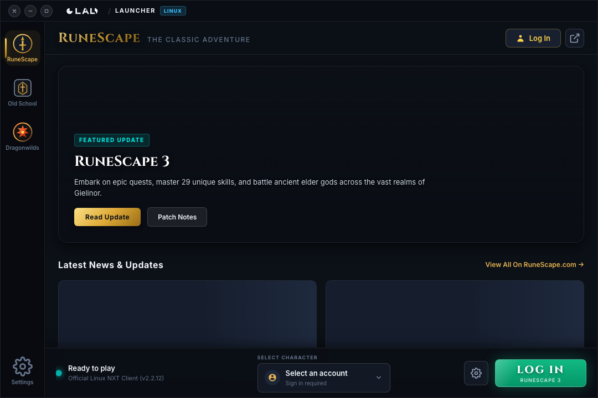
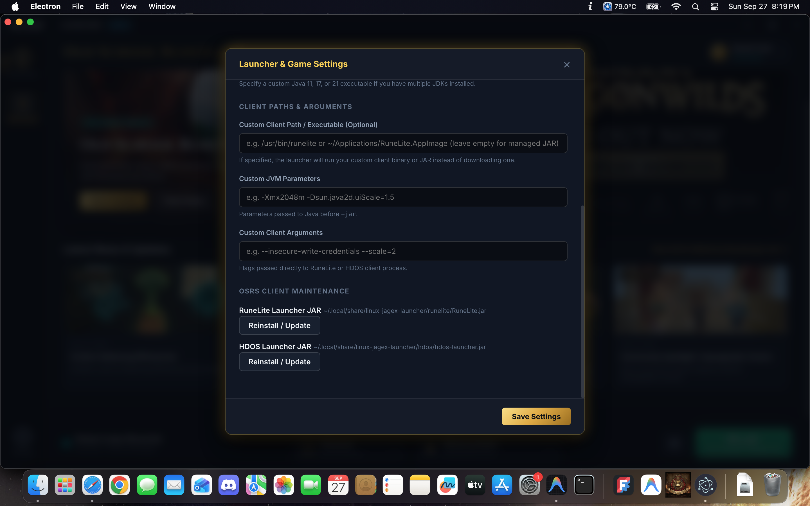
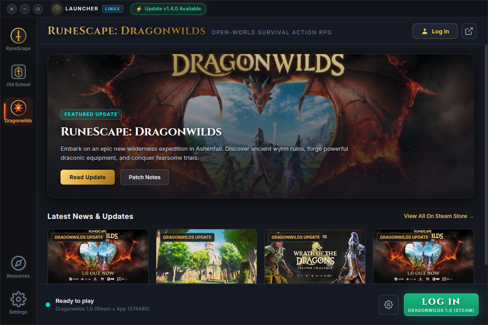

<div align="center">
  

  
  <h1>Linux Jagex Launcher</h1>
  <p><strong>An authentic, native Jagex Launcher for Linux supporting RuneScape 3, Old School RuneScape, and RuneScape: Dragonwilds.</strong></p>

  <p>
    <a href="https://github.com/cook0001/Linux-Jagex-Launcher/actions/workflows/qc.yml"></a>
    <a href="https://github.com/cook0001/Linux-Jagex-Launcher/actions/workflows/build.yml"></a>
    <a href="https://github.com/cook0001/Linux-Jagex-Launcher/releases"></a>
    <a href="LICENSE"></a>
    <a href="https://github.com/cook0001/Linux-Jagex-Launcher"></a>
    <a href="https://cook0001.github.io/Linux-Jagex-Launcher/"></a>
  </p>

  <p>
    <a href="#-key-features">Key Features</a> •
    <a href="#-how-it-compares">How It Compares</a> •
    <a href="#-runescape-3-native-linux">RuneScape 3</a> •
    <a href="#-old-school-runescape">Old School</a> •
    <a href="#-runescape-dragonwilds">Dragonwilds</a> •
    <a href="#-installation">Installation</a> •
    <a href="#-how-it-works">How It Works</a> •
    <a href="#-settings--tweaks">Settings</a> •
    <a href="#-faq--troubleshooting">FAQ</a> •
    <a href="https://forms.gle/KvagBxcmVBB3Q721A" target="_blank">Feedback Form</a> •
    <a href="PRIVACY.md">Privacy Policy</a>
  </p>

  <br />

  
</div>

---

## 🌟 Overview

The **Linux Jagex Launcher** is an open-source, native desktop launcher built to replicate the **1:1 look, feel, and functionality of the official Windows and macOS Jagex Launcher** for Linux users.

Unlike third-party wrappers or Wine prefixes, this launcher:
1. **Replicates the exact official Jagex Launcher UI**, with official promotional hero banners, real-time maintenance PSA broadcasts, live news feeds, character switcher, and official Linux window controls on the left.
2. **Runs native 64-bit Linux binaries**: Zero Wine, zero Proton, and zero emulation overhead for RuneScape 3.
3. **Supports all three Jagex ecosystem titles**: **RuneScape 3 (NXT Client)**, **Old School RuneScape** (RuneLite, HDOS, and the Official Client), and **RuneScape: Dragonwilds**.
4. **Authenticates directly with Jagex** using standard OAuth 2.0 PKCE, with built-in support for Cloudflare Turnstile bot verification and Multi-Factor Authentication.

---

## ⚖️ How It Compares

If you want to play RuneScape on Linux today, you generally encounter three existing approaches: **TormStorm's Flatpak**, **Bolt Launcher**, or Jagex's **official legacy client / beta workarounds**.

Here is how **Linux Jagex Launcher** fundamentally compares and what it does better or differently:

### 📊 Feature Comparison Matrix

| Feature / Capability | **Linux Jagex Launcher (This Project)** | **TormStorm's Flatpak (`com.jagex.Launcher`)** | **Bolt Launcher** | **Official Legacy Client / Jagex "Beta"** |
|:---|:---:|:---:|:---:|:---:|
| **RuneScape 3 Execution** | **100% Native 64-bit Linux ELF** (Zero Wine / Zero Proton) | Windows `.exe` running under Wine / Proton DXVK | ⚠️ Limited / Unofficial workarounds | Native Linux `.deb` (Legacy, unmaintained) |
| **Old School RuneScape** | **Multi-Client Dock** (RuneLite, HDOS, Official) | Official OSRS / RuneLite inside Wine prefix | RuneLite & HDOS native | Official legacy client only |
| **RuneScape: Dragonwilds** | **Integrated Steam Launch** + Live Patch Feeds | ❌ Not supported | ❌ Not supported | ❌ Not supported |
| **Jagex Account Support** | **Full OAuth 2.0 PKCE + Turnstile Webview** | Full (via Windows Launcher in Wine) | Full (via Webview) | ❌ **Broken** (Only supports legacy usernames) |
| **Ubuntu 22.04 / 24.04 OpenSSL Fix** | **Isolated Userspace `libssl1.1`** (Zero host pollution) | N/A (runs Windows OpenSSL DLLs in Wine) | ❌ Manual user intervention required | ❌ Fails `apt install` (`libssl1.1` missing) |
| **Wayland & Audio Auto-Fixes** | **Built-in `Rs3Doctor`** + automatic XWayland/PipeWire flags | Relies on Wine Wayland / X11 bridging | ❌ Not provided | ❌ Freezes on "Loading application resources" |
| **Root Permissions Required?** | ❌ **Never** (100% rootless in userspace) | ❌ Flatpak sandbox | ❌ Rootless | ⚠️ Requires `sudo apt` / `dpkg` |
| **Steam Deck & SteamOS** | **Full Gamepad Navigation + OSK + Grid Art Generator** | Bulky Wine Flatpak; no native gamepad UI | Minimal handheld integration | ❌ No SteamOS support |
| **User Interface Fidelity** | **1:1 Official Jagex Launcher Replica** + Linux window controls | Official Windows UI (inside Wine window) | Custom utilitarian UI | No launcher interface |
| **Resource Overhead** | **Zero-RAM Mode** (Auto-closes 1.5s after launch) | Heavy (Launcher + Wine + CEF persists) | Moderate | N/A |
| **Integrated Auto-Updater** | **In-place AppImage hot-swap** + `.deb` downloader | Flatpak updates only | Manual / GitHub releases | ❌ Deprecated repository |

---

### 🔍 Deep-Dive: What This Launcher Does Better

#### 1. Compared to TormStorm's Flatpak (`jagex-launcher-linux`)
* **Bare-Metal Native Performance vs. Wine/Proton Overhead:**  
  TormStorm's Flatpak packages the Windows `.exe` of the official Jagex Launcher inside a Wine prefix inside a Flatpak container. This means running a full Windows compatibility layer, Windows PE binaries, and executing RuneScape 3 through DXVK and Wine translation layers rather than native Vulkan/OpenGL. **Linux Jagex Launcher runs official 64-bit Linux native ELF binaries directly against your Linux kernel, Mesa/NVIDIA drivers, and PipeWire/PulseAudio with zero emulation layer and zero translation penalty.**
* **Native Filesystem vs. Sandboxed Wine `drive_c`:**  
  Running RuneLite or other tools through Wine isolates their configuration files inside an emulated Windows `drive_c` sandbox. Linux Jagex Launcher runs all clients natively against your standard user profile (`~/.runelite`, `~/.config`), so your existing plugins, tile markers, bank tags, screenshots, and custom configurations work immediately without moving files or setting Flatpak permission overrides.
* **Immunity to Wine CEF & Prefix Breakage:**  
  Updates to Jagex's Windows launcher frequently break the Chromium Embedded Framework (CEF) runtime inside Wine, leading to white screens, frozen login windows, or failed authentications whenever Jagex pushes launcher updates. Linux Jagex Launcher uses a modern, native Linux Electron runtime that communicates cleanly with Jagex's OAuth endpoints and never suffers from Wine translation breakage.

#### 2. Compared to Bolt Launcher
* **First-Class Native RuneScape 3 Support:**  
  Bolt was built predominantly around Old School RuneScape and RuneLite. It does not provide automated rootless deployment for the native RS3 NXT client, does not solve the modern OpenSSL 1.1 dependency conflict on Ubuntu 22.04 and 24.04 LTS, and lacks graphics and audio workarounds for modern Linux display servers.
* **The Complete Jagex Catalog in One Dock:**  
  Linux Jagex Launcher supports the entire Jagex catalog in a single launcher interface: **RuneScape 3** (native ELF), **Old School RuneScape** (with an instant dropdown dock for RuneLite, HDOS, and the Official Client), and **RuneScape: Dragonwilds** (one-click Steam launch with live Steam RSS patch notes).
* **Authentic 1:1 Jagex Launcher Experience:**  
  Rather than a generic or minimalist utility launcher, this project faithfully recreates the official Jagex Launcher design: official promotional hero art and video banners, live maintenance PSA status banners, official news carousels, character switching with active membership status resolution, and left-sided Linux window controls matching GNOME/Ubuntu conventions.
* **Steam Deck & Handheld First-Class Citizen:**  
  Includes an out-of-the-box HTML5 Gamepad API controller navigation engine (bumpers switch games, D-pad navigates, face buttons trigger actions), Gamescope 1280×800 touch layout, automatic Steam on-screen keyboard (OSK) triggering, and a built-in one-click Steam shortcut & grid artwork generator.

#### 3. Compared to Jagex's Official Legacy Client & Beta Workarounds
* **Solves the Mandatory Jagex Account Dead-End:**  
  Jagex's official native Linux client (`runescape-launcher` `.deb`) was abandoned before Jagex introduced mandatory Jagex Accounts. When Jagex mandated account migration, Linux players who upgraded were locked out because the legacy client only accepts legacy username/password credentials. **Linux Jagex Launcher provides the missing link**, executing full OAuth 2.0 PKCE authentication with Cloudflare Turnstile bot verification and passing the secure session token directly to the native Linux client.
* **Solves the Ubuntu 22.04 & 24.04 `libssl1.1` Mismatch Safely:**  
  Modern Linux distributions dropped `libssl1.1` in favor of OpenSSL 3.0 (`libssl3`). Attempting to install Jagex's official `.deb` package fails with unmet dependencies, and force-installing outdated Ubuntu 20.04 packages with `dpkg` risks corrupting host package managers during system updates. Our launcher provisions an isolated `libssl.so.1.1` library exclusively in userspace (`~/.local/share/linux-jagex-launcher/compat/lib64/`) without ever modifying host system libraries.
* **100% Rootless Installation:**  
  The official Jagex documentation demands `sudo apt install`. Linux Jagex Launcher extracts, installs, updates, and runs the client entirely in userspace using `ar` and `tar`. You will never need to enter a root or `sudo` password.
* **Fixes the "Loading Application Resources" Freeze Out of the Box:**  
  The legacy client notoriously hangs on modern Linux desktops due to Wayland compositor conflicts, PipeWire audio starvation, and GTK2 input method locks. Linux Jagex Launcher automatically sets the necessary environment variables (`GDK_BACKEND=x11`, `SDL_VIDEODRIVER=x11`, `PULSE_LATENCY_MSEC=100`, unsets `XMODIFIERS`, and provides a Mesa Zink override) to ensure smooth, crash-free launches.

---

## ✨ Key Features

### ⚡ RuneScape 3 (Native Linux NXT)
- **Native 64-Bit ELF Execution**: Launches Jagex's official compiled 64-bit Linux binary directly against your Linux kernel, Mesa/Vulkan drivers, and display server.
- **Rootless Auto-Deployment**: Downloads and extracts Jagex's official Ubuntu `.deb` package directly into your user data directory (`~/.local/share/linux-jagex-launcher/client/`) using userspace archive utilities (`ar` and `tar`). **Never requires `sudo` or root permissions**.
- **Isolated OpenSSL 1.1 Compat (Ubuntu 22.04 & 24.04 Fix)**: Automatically provisions isolated `libssl.so.1.1` and `libcrypto.so.1.1` libraries in userspace (`~/.local/share/linux-jagex-launcher/compat/lib64/`). Completely resolves the modern OpenSSL 3 mismatch without touching host `apt` or risking package manager conflicts.
- **Wayland & "Loading Application Resources" Fixes**: Automatically enforces `GDK_BACKEND=x11` and `SDL_VIDEODRIVER=x11` to run cleanly over XWayland, sets `PULSE_LATENCY_MSEC=100` to prevent sound engine starvation, unsets `XMODIFIERS` to avoid GTK2 input hangs, and includes an optional Mesa Zink (`MESA_LOADER_DRIVER_OVERRIDE=zink`) override for NVIDIA GPUs.
- **System Compatibility Doctor (`Rs3Doctor`)**: Integrated pre-flight diagnostic tool in Settings that verifies graphics drivers, display servers, and runtime dependencies, providing copyable terminal commands and one-click fixes.
- **Hardware Acceleration**: Full native Vulkan and OpenGL rendering on AMD Radeon (RADV), Intel Arc/Iris, and NVIDIA proprietary drivers.
- **PipeWire & PulseAudio Integration**: Pre-configured audio routing to eliminate crackles, buffer underruns, or latency.
- **Live Maintenance Warnings**: Fetches real-time server status, game downtime warnings, and scheduled cold-update alerts directly from Jagex CDN feeds.
- **Performance Tweaks**: One-click integration with Feral GameMode (`gamemoderun`) and MangoHud.

<div align="center">
  
</div>

---

### ⚔️ Old School RuneScape
- **Multi-Client Dock Dropdown**: Switch seamlessly between **RuneLite**, **HDOS**, and the **Official Client** right from the bottom dock.
- **RuneLite Integration**: Detects existing system installations or downloads the official launcher JAR automatically. Runs directly against your normal user profile, preserving all your `~/.runelite` plugins, tile markers, bank tags, screenshots, and browser links.
- **HDOS (High-Definition Open Source)**: Auto-downloads and verifies the latest HDOS launcher from official CDNs, passing your Jagex session ID for instant 2008-era HD graphics at 144Hz+.
- **Custom JVM & Memory Tuning**: Easily configure custom Java paths (Java 11/17/21), heap size parameters (e.g. `-Xmx2048m`), or custom client flags.

<div align="center">
  
</div>

---

### 🐉 RuneScape: Dragonwilds
- **Steam Integration**: Seamless one-click launch via `steam://run/1374490` directly into Jagex's new open-world survival action RPG in Ashenfall.
- **Real-Time Steam RSS Feed**: Live event broadcasts, patch notes (1.0.0.4+), and community announcements fetched directly from Valve's official news feed for App ID `1374490`.
- **Streamlined Workflow**: Automatically hides character selection when on the Dragonwilds tab since character management is handled directly in-game.

<div align="center">
  
</div>

---

### 🛡️ Jagex Account Security & Privacy
- **Direct OAuth 2.0 with PKCE**: Connects straight to `account.jagex.com`. The launcher never touches or logs your plain-text password.
- **Interactive Cloudflare Turnstile Verification**: Built-in compliant webview allows you to complete Turnstile checkboxes and 2FA challenges effortlessly.
- **100% Client-Side / Zero Telemetry**: No third-party servers, analytics, or tracking. Tokens (`JX_SESSION_ID`) and profile data reside exclusively in local user config (`~/.config/linux-jagex-launcher/`).

---

### 🚀 Gaming Enhancements & Older Linux Hardware Support
- **Performance Mode (Low-Spec / Older Hardware)**: Disables GPU-heavy CSS `backdrop-filter` blurs, suppresses continuous animation loops, applies lightweight memory management, and optimizes GPU fill-rate for older Intel HD Graphics (2000–5500), legacy AMD GPUs, and non-composited window managers (XFCE, MATE, Openbox).
- **Mesa OpenGL Compatibility Profile Override (`MESA_GL_VERSION_OVERRIDE=4.5COMPAT`)**: Forces Mesa to expose OpenGL 4.5 in compatibility mode. Resolves OpenGL initialization crashes on older Intel (Ivy Bridge, Haswell) and legacy AMD TeraScale GPUs when launching RuneScape 3.
- **Legacy DRI3/DRI2 Fallback (`LIBGL_DRI3_DISABLE=1`)**: Eliminates window stuttering, flickering, and startup lockups on classic Intel SNA X11 drivers.
- **Lightweight OSRS Heap Tuning**: When Low-Spec Mode is active, automatically limits RuneLite/HDOS heap to 768MB (`-Xmx768m -XX:+UseG1GC`) to prevent swap thrashing and Linux Out-Of-Memory (OOM) killer terminations on 4GB–8GB RAM systems.
- **Zero RAM Mode ("Close on Launch")**: Automatically closes the launcher 1.5 seconds after your game launches, freeing 100% of the launcher's memory (150–250MB RAM).
- **Chromium GPU Blocklist Bypass**: Automatically passes `ignore-gpu-blocklist` and `enable-gpu-rasterization` on Linux to force hardware-accelerated rendering on legacy GPUs rather than burning CPU cycles on SwiftShader software rasterization.
- **System Tray Mode**: Minimize cleanly to the system tray to keep characters ready without cluttering your taskbar.
- **Official Linux Window Controls**: Minimize, resize, and close buttons on the top-left matching standard Ubuntu and GNOME conventions.

---

### 🌐 World Latency & Ping Prober (RS3 & OSRS)
- **High-Performance Parallel Prober**: Concurrently benchmarks ping latencies across all active RuneScape 3 (Worlds 1–141) and Old School RuneScape (Worlds 301–599) servers in ~1.2 seconds using parallel worker pools.
- **Header Quick Access & Dedicated Settings Cards**: Launch the prober directly via the Globe icon next to the Account Manager in the top header, or inspect game-specific world lists within **Settings > RuneScape 3** and **Settings > Old School RuneScape**.
- **Accurate In-Game World Mapping**: OSRS server subdomains (`oldschoolX`) automatically map to true in-game world numbers (`300 + X`, e.g., World 301, 302, 386) matching your in-game world select screen.
- **Regional Filtering & Visual Badges**: Filter worlds dynamically by US East/West, Europe/UK, Germany, or Australia with color-coded response times (Green `<50ms`, Amber `50–100ms`, Red `>100ms`).
- **Standalone Terminal Scripts**: Includes production-grade parallel CLI tools ([`docs/rs3-ping.sh`](docs/rs3-ping.sh) and [`docs/osrs-ping.sh`](docs/osrs-ping.sh)) executable directly from terminal or shell shortcuts without opening the GUI.

---

### 📚 Community Resources & Tools Hub
- **Dedicated Sidebar Access**: Launch the Hub via the **Resources** tab positioned right above Settings in the launcher navigation bar.
- **Smart Game Auto-Focus**: Automatically opens directly to whichever game is currently active (**RuneScape 3**, **Old School**, or **Dragonwilds**).
- **Curated Player-Centric Directory**: Includes one-click access to the official wikis, Alt1 Toolkit, PvM Encyclopedia (PvME), OSRS Wiki DPS Calculator, GE Tracker, Quest Helper, Wise Old Man, TempleOSRS, MapGenie Ashenfall Interactive Map, and community hubs.
- **Instant Live Search**: Real-time filtering by tool name, purpose, or category (e.g., search "dps", "map", "clue", or "prices").
- **Secure Native Browser Launch**: Safely opens all links in your default Linux browser through the launcher's sandboxed IPC bridge.

---

### 🔄 Integrated Auto Updater
- **Direct In-App AppImage Updates**: When running as an AppImage, queries GitHub Releases directly, downloads update binaries with real-time streaming progress, validates SHA256 checksums, and performs seamless in-place hot-swapping and restart.
- **Debian / Ubuntu (.deb) Downloader**: Automatically downloads updated `.deb` packages to `~/Downloads` and outputs copy-paste installation commands.
- **Distribution-Aware Notifications**: Respectfully detects Flatpak (`flathub`) and Arch Linux (`AUR`) environments, informing users when upstream package updates are available without conflicting with system package managers.
- **Startup Auto-Check & Version Management**: Configure automatic background checks in Settings -> General or check on-demand anytime, with support for skipping specific versions.

---

### 🎮 Steam Deck & SteamOS Handhelds
- **Automated Rootless Fast-Installer**: Run one command in Konsole without touching `steamos-readonly` or typing `sudo`.
- **1280×800 (16:10) Touch Scaling**: Scaled touch targets, Gamescope borderless optimization, and 800p height accommodations.
- **Full Gamepad / Controller Navigation**: Native HTML5 Gamepad API integration (Bumpers cycle games, D-Pad/stick navigates, `A` launches/selects, `B` backs out, `Y` switches character, `X` selects client, `Start` opens Settings).
- **Steam Virtual Keyboard (OSK)**: Auto-triggers `steam://open/keyboard` when text input boxes are focused in Gaming Mode.
- **Steam Library & Grid Artwork Generator**: Built-in utility in Settings to register the launcher in Steam's `shortcuts.vdf` with official high-res cover, hero, and banner art.

---

### 📌 Native System Tray & Quick Folders Hub
- **System Tray Mode**: Minimize cleanly to the system tray to keep characters ready without taskbar clutter. Right-click the tray icon to quickly launch active characters or restore the window.
- **Quick Shortcuts & Client Folders Hub**: One-click folder access in Settings for screenshots, logs, and game caches across **RuneLite** (`~/.runelite`), **RuneScape 3** (`~/.local/share/Jagex`), and **HDOS** (`~/.hdos`).
- **Desktop Shortcuts & Icon Re-Registration**: Built-in repair tool in Settings to re-generate standard FreeDesktop `.desktop` launchers and install multi-resolution system icons (`16x16` up to `1024x1024`) for the Launcher, RuneLite, HDOS, and the Official OSRS client.

---

## 📥 Installation

Download the latest release package from the **[GitHub Releases page](https://github.com/cook0001/Linux-Jagex-Launcher/releases)**.

### Option 1: Ubuntu / Linux Mint / Pop!_OS (Official Launchpad PPA)

The official Canonical Launchpad PPA provides native `.deb` packages built directly in Canonical's cloud infrastructure for **Ubuntu 26.04 LTS (`resolute`)**, **Ubuntu 24.04 LTS (`noble`)**, and **Ubuntu 22.04 LTS (`jammy`)** (as well as Linux Mint and Pop!_OS derivatives). System dependencies are resolved automatically, and updates are delivered seamlessly through standard `apt upgrade`:

**1. Add the PPA repository:**
```bash
sudo add-apt-repository ppa:danielcook2016/linux-jagex-launcher
```

**2. Update package list and install:**
```bash
sudo apt update
```
```bash
sudo apt install -y linux-jagex-launcher
```

**3. Launch:**
```bash
linux-jagex-launcher
```

**To uninstall or remove the PPA:**
```bash
sudo apt remove linux-jagex-launcher
```
```bash
sudo add-apt-repository --remove ppa:danielcook2016/linux-jagex-launcher
```

---

### Option 2: Debian / Ubuntu / Linux Mint (Standalone `.deb`)

**One-Line Fast Install:**
```bash
curl -sSL https://cook0001.github.io/Linux-Jagex-Launcher/install.sh | bash
```

**Or manual install via `apt`:**
```bash
# Download latest .deb from Releases:
curl -LO https://github.com/cook0001/Linux-Jagex-Launcher/releases/latest/download/jagex-launcher_1.4.0_amd64.deb
```
```bash
# Install package (apt automatically pulls all required system libraries):
sudo apt install ./jagex-launcher_1.4.0_amd64.deb
```

---

### Option 3: Universal AppImage

Works on virtually any modern 64-bit Linux distribution (Ubuntu, Fedora, Arch, SteamOS, Debian, Mint):

```bash
# Download AppImage from Releases:
curl -LO https://github.com/cook0001/Linux-Jagex-Launcher/releases/latest/download/Jagex-Launcher-1.4.0.AppImage
```
```bash
# Make executable:
chmod +x Jagex-Launcher-1.4.0.AppImage
```
```bash
# Run:
./Jagex-Launcher-1.4.0.AppImage
```

---

### Option 4: Steam Deck & SteamOS (Automated Fast-Installer)

Installs 100% rootless in userspace without modifying read-only system partitions. Automatically registers as a Non-Steam Game with official high-res Steam Grid artwork:

In **Desktop Mode** (`Steam Button` &rarr; `Power` &rarr; `Switch to Desktop`), open **Konsole** and run:
```bash
curl -sSL https://cook0001.github.io/Linux-Jagex-Launcher/deck-install.sh | bash
```

Once complete, return to **Gaming Mode** and launch directly from your Non-Steam library with full physical controller/gamepad navigation!

---

### Option 5: Arch Linux / Manjaro (AUR)

Install via any AUR helper:

```bash
# Using yay:
yay -S linux-jagex-launcher-bin
```
```bash
# Using paru:
paru -S linux-jagex-launcher-bin
```

---

### Option 6: Fedora / RHEL

```bash
sudo dnf install -y fuse-libs
```
```bash
curl -LO https://github.com/cook0001/Linux-Jagex-Launcher/releases/latest/download/Jagex-Launcher-1.4.0.AppImage
```
```bash
chmod +x Jagex-Launcher-1.4.0.AppImage
```
```bash
./Jagex-Launcher-1.4.0.AppImage
```

---

### Option 7: Build from Source

**Clone & Enter Repository:**
```bash
git clone https://github.com/cook0001/Linux-Jagex-Launcher.git && cd Linux-Jagex-Launcher
```

**Install Dependencies:**
```bash
npm install
```

**Run Quality Control Suite (Linter, Typecheck, Unit Tests, Vite Production Build):**
```bash
npm run qc
```

**Run in Development Mode:**
```bash
npm run dev
```

**Package Native Linux Binaries (AppImage, deb, tar.gz):**
```bash
npm run dist
```

---

## 🔧 Settings & Customization

Click the **Gear icon** in the bottom dock to access the unified Settings Modal:

| Tab | Options |
|---|---|
| **General** | Close on Launch (0 MB RAM mode), Minimize to System Tray, Feral GameMode (`gamemoderun`), MangoHud overlay. |
| **Old School RuneScape** | Default client selection (RuneLite / HDOS / Official), Custom Java binary path, Custom executable/JAR override, Custom JVM arguments (`-Xmx`), Custom client flags, Flatpak client auto-detection, One-click client verify/reinstall, Built-in OSRS World Latency & Ping prober. |
| **RuneScape 3** | Custom client binary override, Extra launch parameters, Mesa Threaded OpenGL (`mesa_glthread=true`) performance boost, Force X11/XWayland, PulseAudio/PipeWire latency mitigation, Client cache verification, Built-in RS3 World Latency & Ping prober. |
| **Account Management** | Multi-account login and fast switching, individual character selection with active membership badges. |

---

## 🔍 How It Works

When you click **PLAY**:
1. The launcher retrieves your active character credentials (`JX_SESSION_ID`, `JX_CHARACTER_ID`, `JX_DISPLAY_NAME`) obtained via direct OAuth 2.0 with `account.jagex.com`.
2. The launcher prepares the target game client:
   - For **RuneScape 3**: Launches the native ELF `runescape` binary with SDL X11, PulseAudio/PipeWire variables, and `--configURI "https://www.runescape.com/k=5/l=0/jav_config.ws"`.
   - For **RuneLite**: Executes the launcher jar via `java -jar` (or native AppImage) while passing `--insecure-write-credentials` and session environment variables, pointing `HOME` to your regular user home directory.
   - For **HDOS**: Executes the official `hdos-launcher.jar` with `JX_SESSION_ID` and `JX_CHARACTER_ID` environment variables.
   - For **Dragonwilds**: Launches directly through Steam using `steam://run/1374490`.
3. If enabled, the launcher terminates itself or minimizes to the tray to save memory.

---

## ❓ FAQ & Troubleshooting

<details>
<summary><strong>Will I get banned for using this launcher?</strong></summary>

No. This launcher does not alter game binaries, manipulate memory, or inject cheat code. It operates identically to how the official launcher launches clients on Windows and macOS: by requesting an official OAuth2 token from Jagex and passing standard environment variables to the game client subprocess.
</details>

<details>
<summary><strong>Do my RuneLite plugins and bank tags stay saved?</strong></summary>

Yes! The launcher respects your system user profile. All configuration, plugins, screenshots, and tile markers in `~/.runelite` remain completely untouched.
</details>

<details>
<summary><strong>How does the native Linux RS3 client run without root?</strong></summary>

The launcher extracts Jagex's official Ubuntu `.deb` package into your local user data directory (`~/.local/share/linux-jagex-launcher/client/`) using userspace archive utilities (`tar` / `ar`), allowing it to install and update without ever requesting `sudo` or root permissions.
</details>

<details>
<summary><strong>AppImage won't open on Ubuntu 24.04 or Fedora?</strong></summary>

Modern distributions may require the FUSE library to run AppImages:
```bash
# Ubuntu / Debian
sudo apt install libfuse2t64  # or libfuse2 on 22.04

# Fedora
sudo dnf install fuse-libs
```
Alternatively, install the `.deb` package instead!
</details>

<details>
<summary><strong>How does this launcher resolve the libssl1.1 error on Ubuntu 22.04 & 24.04?</strong></summary>

Modern Ubuntu versions (22.04 LTS and 24.04 LTS+) transitioned completely to OpenSSL 3 (`libssl3`) and dropped `libssl1.1`. The official native Jagex Linux client was built against `libssl.so.1.1` and fails to start on clean modern installations.

**Never force-install outdated `libssl1.1` packages from Ubuntu 20.04 (Focal) into your host system package manager**, as this can corrupt `apt` during subsequent system upgrades.

**The Linux Jagex Launcher automatically solves this safely:**
1. It downloads the isolated `libssl.so.1.1` and `libcrypto.so.1.1` shared libraries into userspace (`~/.local/share/linux-jagex-launcher/compat/lib64/`).
2. When launching the game, it injects an isolated `LD_LIBRARY_PATH` targeting only the game process.
3. Your system's package manager (`apt`, `dnf`, `pacman`) remains 100% clean and untouched!
</details>

<details>
<summary><strong>Why does RuneScape 3 freeze on "Loading application resources" and how do I fix it?</strong></summary>

The "Loading application resources" hang is typically caused by:
1. **Wayland Compositor Conflicts**: The legacy GTK2/SDL2 client crashes or locks when interacting directly with modern Wayland compositors. **Fix**: Linux Jagex Launcher automatically injects `GDK_BACKEND=x11` and `SDL_VIDEODRIVER=x11` to route display operations cleanly through XWayland.
2. **Missing OpenGL/Vulkan Drivers**: Minimal desktop installs may lack `libopengl0` or `mesa-vulkan-drivers`. Run **Settings > RuneScape 3 > Run Diagnostics** to check.
3. **Audio Buffer Underrun**: PulseAudio/PipeWire buffers underflowing during initial asset decompression can block the main thread. Linux Jagex Launcher sets `PULSE_LATENCY_MSEC=100` to prevent audio starvation.
4. **Corrupted Shader/Asset Cache**: Click **Settings > RuneScape 3 > Clear Cache** to wipe stale cache files from `~/.jagex_launcher` and force a clean reload.
5. **NVIDIA on Wayland**: Enable **Settings > RuneScape 3 > GPU Driver: Mesa Zink Override** to route OpenGL rendering over Vulkan (`MESA_LOADER_DRIVER_OVERRIDE=zink ZINK_DEBUG=flushsync`).
</details>

<details>
<summary><strong>Can I play on Linux if I migrated to a Jagex Account?</strong></summary>

Yes! Characters migrated to Jagex Accounts can no longer authenticate using legacy in-client usernames/passwords. Linux Jagex Launcher performs the official OAuth 2.0 PKCE authentication flow directly with Jagex Auth servers, verifies Cloudflare Turnstile, and injects your active `JX_SESSION_ID`, `JX_CHARACTER_ID`, and `JX_DISPLAY_NAME` into the RS3 client subprocess.
</details>

<details>
<summary><strong>Why should I never run the launcher with sudo or root?</strong></summary>

Running the launcher with `sudo` will cause files in `~/.local/share`, `~/.config`, `~/.runelite`, and `~/.jagex_launcher` to be written with `root:root` ownership. Subsequently launching as a normal user will result in permission denied crashes, failed client updates, or corrupted settings. Always run the launcher as your standard desktop user.
</details>

---

## 💬 Community Feedback

Have feature suggestions, performance reports, or distro compatibility feedback? Help us shape future updates by submitting your thoughts through our [Community Feedback Survey](https://forms.gle/KvagBxcmVBB3Q721A).

---

## 🤝 Contributing

Contributions, bug reports, and suggestions are warmly welcomed! Please read [CONTRIBUTING.md](CONTRIBUTING.md) to get started.

---

## 📄 License & Legal Notice

This project is licensed under the [MIT License](LICENSE).

**Trademark Disclaimer:**  
*RuneScape*, *Old School RuneScape*, and *Jagex* are registered trademarks of Jagex Limited in the United Kingdom, United States, and other countries. This software is an independent open-source project and is not affiliated with, endorsed by, sponsored by, or associated with Jagex Limited. All game titles, screenshots, and trademarks belong to their respective owners.
